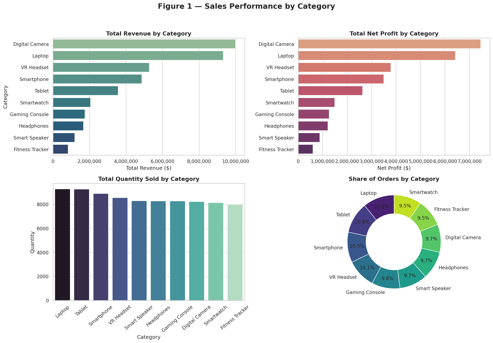

# Orders Data Summary — 4 Figures (4 Subplots Each)

This project analyzes a dataset of **20,000 e-commerce orders** and produces four summary figures (each containing 4 subplots) covering category performance, time trends, geographic distribution, and order status / sales team performance.

The notebook loads `Orders.csv`, computes revenue and profit fields, and generates the following figures:

1. **Category Performance**
2. **Time Trends**
3. **Geographic Distribution**
4. **Order Status, Discounts & Top Sales Performers**

---

## 📁 Project Files

| File | Description |
|---|---|
| `Orders_Summary_Figures.ipynb` | Jupyter notebook with all the code and rendered figures |
| `data/Orders.csv` | Raw orders dataset (20,000 rows, 17 columns) |
| `figure1_category_performance.png` | Figure 1 image |
| `figure2_time_trends.png` | Figure 2 image |
| `figure3_geography.png` | Figure 3 image |
| `figure4_status_discount_sales.png` | Figure 4 image |

---

## 🧾 Dataset Preview (first 10 rows)

| Order ID | Order Date | Day | Country | City | Lat | Lng | Full Name | Category | Sub Category | Item | SalesPerson ID | Quantity | Unit Price | Discount | Total Cost | Status |
|---:|---|---|---|---|---:|---:|---|---|---|---|---|---:|---:|---:|---:|---|
| 1 | 01/01/2023 | Mon | Syria | homs | 34.7326 | 36.7136 | Lina Alrrashid | Tablet | Apple iPad | iPad Pro 12.9" | N498 | 4 | 999 | 38.36 | 891.91 | False |
| 2 | 01/01/2023 | Tue | Saudi Arabia | riyadh | 24.7136 | 46.6753 | Omar Eurul | Smartphone | Samsung Galaxy | Galaxy S21 Ultra | X918 | 3 | 1199 | 517.97 | 302.15 | True |
| 3 | 01/01/2023 | Tue | Saudi Arabia | riyadh | 24.7743 | 46.7386 | Iman Iismaeil | Digital Camera | Panasonic Lumix | Panasonic Lumix GH5 | I036 | 4 | 1299 | 883.32 | 831.36 | True |
| 4 | 01/01/2023 | Mon | United Arab Emirates | abu dhabi | 24.4539 | 54.3773 | Ahmad Rihan | Tablet | Samsung Galaxy Tab | Galaxy Tab A8 | E804 | 6 | 199 | 33.31 | 129.55 | True |
| 5 | 01/01/2023 | Wed | USA | washington | 38.9072 | -77.0369 | Sami Altawil | Headphones | Sennheiser HD | Sennheiser HD 450BT | Q149 | 4 | 129 | 11.26 | 111.37 | True |
| 6 | 01/01/2023 | Mon | Syria | aleppo | 36.2021 | 37.1343 | Ahed Salim | Smartwatch | Garmin Fenix | Garmin Fenix 6S | J431 | 2 | 499 | 232.19 | 138.32 | True |
| 7 | 01/01/2023 | Tue | Saudi Arabia | riyadh | 24.7136 | 46.6753 | Amira Alrahil | Digital Camera | Panasonic Lumix | Panasonic Lumix S1H | S190 | 3 | 3499 | 2203.67 | 197.34 | True |
| 8 | 01/01/2023 | Mon | Egypt | cairo | 30.0444 | 31.2357 | Muhamad Bitahish | Headphones | Anker Soundcore | Anker Soundcore Liberty Air 2 Pro | R389 | 3 | 99 | 74.49 | 47.04 | False |
| 9 | 01/01/2023 | Tue | Saudi Arabia | aseer | 18.2311 | 42.5004 | Fadi Aljabaan | Laptop | HP Envy | Envy x360 | I974 | 4 | 899 | 359.60 | 881.02 | True |
| 10 | 01/01/2023 | Mon | USA | washington | 38.9072 | -77.0369 | Zahir Almunajid | Smart Speaker | Apple HomePod | Apple HomePod mini | R236 | 3 | 99 | 598.40 | 672.17 | True |

**Dataset shape:** 20,000 rows × 17 columns
**Countries covered:** Syria, Saudi Arabia, United Arab Emirates, USA, Egypt, Morocco, France
**Categories covered:** Tablet, Smartphone, Digital Camera, Headphones, Smartwatch, Laptop, Smart Speaker, VR Headset, Fitness Tracker, Gaming Console

---

## 🔧 Computed Fields

Two additional fields are derived from the raw data before analysis:

```python
Total_Revenue = (Quantity * Unit Price) - Discount
Net_Profit    = Total_Revenue - Total Cost
```

A `Year_Month` field (e.g. `2023-01`) is also derived from `Order Date` to support monthly time-series aggregation.

---

## 📊 Figures

### Figure 1 — Sales Performance by Category
Total revenue, net profit, quantity sold, and share of orders across the 10 product categories.



### Figure 2 — Orders Trend Over Time
Monthly order counts, monthly revenue, orders by day of week, and monthly quantity sold.


### Figure 3 — Geographic Distribution of Orders
Orders and revenue by country, top 10 cities by order count, and a scatter map of order locations colored by revenue.


### Figure 4 — Order Status, Discounts & Top Sales Performers
Order status split (completed vs. cancelled), quantity distribution, discount distribution, and the top 10 sales persons by revenue.


---https://raw.githubusercontent.com/mohammed-mhmu/Portfolio-Project/main/Analisis%20Orders/notebook/files/figure4_status_discount_sales.png

/mohammed-mhmu/Portfolio-Project/blob/main/Analisis%20Orders/notebook/files/figure1_category_performance.png
## ▶️ How to Run

1. Make sure `Orders.csv` is placed inside a `data/` folder next to the notebook (`data/Orders.csv`).
2. Install dependencies:
   ```bash
   pip install pandas numpy matplotlib seaborn
   ```
3. Open and run `Orders_Summary_Figures.ipynb` in Jupyter — all four figures will render inline.

---

## 🛠️ Tools Used

- **pandas** / **numpy** — data loading and aggregation
- **matplotlib** / **seaborn** — visualization